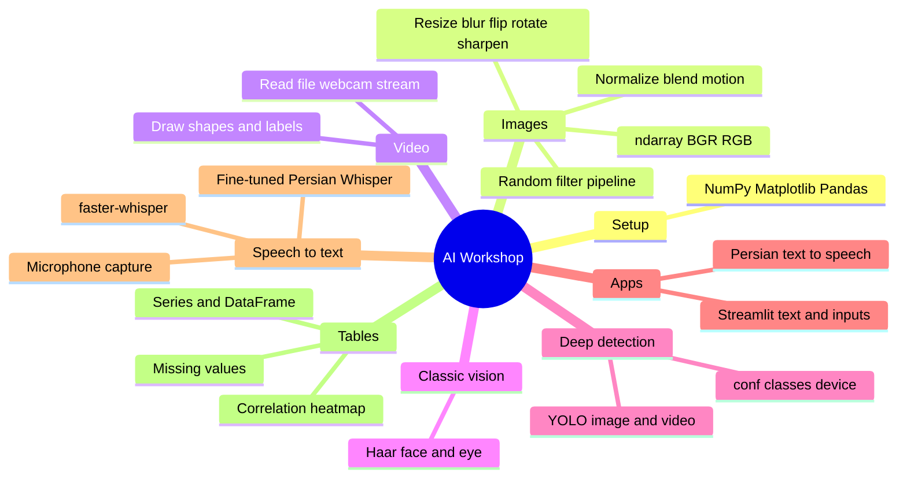

# AI Workshop — Mind Map

Learned topics, taken from the course `.py` files (each class is two parts; topics sit in `#region` blocks).

Update this file at the end of every session: add a `## Session N` section, then add the same branches to the diagram below.

Last built from code: **2026-10-08** (through Session 9, Part 1).

## How the course fits together

The spine is **CRISP-DM**: Business Understanding → Data Understanding → Data Preparation → Modeling → Evaluation → Deployment.

So far the class has stayed on **data understanding and preparation**, first for unstructured media (image, video, text, voice), then for structured tables. Modeling is named, and only classic detection (Haar, YOLO) and speech models have been run, not trained.



## Session 1 — Python stack

Code on disk is only the import block. Part 1 has no lesson file.

- NumPy
- Matplotlib (`pyplot`, `image`)
- Pandas

Source: `Videos/AI workshop/Session1/Part2/Part2/Project/First_Sample.py`

## Session 2 — OpenCV image basics

CRISP-DM introduced here, with Data Preparation aimed at images. OpenCV (1999, C, bindings for Python).

### Part 1 — `Session2_1.py`

- **Image as an array** — `cv2.imread`, `shape` (height, width, channels), `size`, `ndim`, `dtype` `uint8` (0–255)
- **Show an image** — `imshow`, `waitKey`, `destroyAllWindows`
- **Keys** — ESC closes, `s` saves, `ord`
- **Save** — `imwrite` (for example BMP), return flag
- **Normalization** — rescale to 0–1 with `/ 255` or `(x - min) / (max - min)`; outliers
- **Grayscale** — `IMREAD_GRAYSCALE` (fewer channels, less compute)
- **Alpha** — `IMREAD_UNCHANGED` is 4 channels; `split`; 0 transparent, 255 opaque
- **Color order** — OpenCV is BGR, Matplotlib is RGB; `cvtColor`
- **Min–max normalizer** — lambda / function; denormalize back to `uint8` with `255 * values`
- **Blending** — add a normalized mask with a weight (brightness)
- **Motion** — `input - background`, then normalize; threshold mentioned (`> 0.4`)
- **Exercise** — original vs grayscale vs reduced grayscale

Source: `Videos/AI workshop/Session2/Session2/Part1/Project/Session2_1.py`

## Session 3 — Image preparation

Unstructured data: a video is frames, a frame is an image. Preparation ops named in the note: resize, blur, sharpen.

### Part 2 — `Session3_1.py`

- **Resize** — `cv2.resize`, new `shape` / `size`, before-after with Matplotlib
- **`show_before_after`** — BGR→RGB, two subplots (reused in later sessions)
- **Mean blur** — `cv2.blur`; soft / matte images, augmentation
- **Gaussian blur** — `GaussianBlur`
- **Median blur** — salt-and-pepper noise
- **Bilateral filter** — smooth while keeping edges (used toward detection)
- **Flip** — horizontal `1` (Y axis), vertical `0` (X axis), both `-1`
- **Rotate** — `getRotationMatrix2D` + `warpAffine`; fixed canvas vs fit-canvas so corners are not cropped
- **Sharpen** — 3×3 convolution kernel, `filter2D`
- **Random pipeline** — randomly chain blur, Gaussian, sharpen, median, flip, rotation, Gaussian noise

### Extras in the same project (not the main image regions)

- **Stats sketch** — `statistics.mean` / `median`, Seaborn histogram (`etc.py`)
- **Tkinter widget gallery** — checkbuttons, option menu, menubutton (`etc/AllWidgets.py`)

Part 1 of this session is a short note only (no `.py`).

Source: `Videos/AI workshop/Session3/Session3/Part2/Project/Project/Session3_1.py`

## Session 4 — Drawing and video

The class copy is the repo file (no Session 4 folder under Videos).

### `sessions/Session4/main.py`

- **Empty image** — `np.zeros` (height, width, 3), `uint8`
- **Line** — `cv2.line` (points, color, thickness); show with Matplotlib or OpenCV; `imwrite`
- **Rectangle** — `cv2.rectangle` on a photo (outline)
- **Filled tint** — normalize to 0–1, rectangle mask, add `0.2 * mask`
- **Circle** — `cv2.circle`, outline vs filled (`thickness` negative)
- **Polylines** — `cv2.polylines`, closed shapes
- **Filled polygon** — `cv2.fillPoly` (star exercise)
- **Video capture** — `VideoCapture`: camera index `0`, a local file, or a URL; `isOpened`, `read` → `(ret, frame)`
- **Webcam loop** — read frames until `q`

## Session 5 — Annotation, Haar cascades, Streamlit

### Part 1 — drawing on images, then detection (`sessions/session5/main.py`)

- **Text** — `putText` (Hershey font, scale, color, `LINE_AA`) plus a rectangle label
- **Markers** — `drawMarker`: cross, star, diamond, triangle, square
- **Marker exercise** — mark a list of corner points
- **Arrow** — `arrowedLine`, `tipLength`
- **Face detection** — `CascadeClassifier` + `haarcascade_frontalface_default.xml`; grayscale; `detectMultiScale`; green rectangle; webcam until `q`
- **Eye detection** — `haarcascade_eye.xml`; box + `putText("eye")`

Same face loop also in `Videos/.../Session5/.../SampleProject.py`.

### Part 2 — first Streamlit app

- Install / run: `streamlit run ... --server.address --server.port`
- `st.write`, `st.title`
- `st.header`, `st.markdown` (including HTML), `st.divider`, `st.code`

Sources: `sessions/session5/main.py`, `sessions/session5/streamlit_app.py`, Videos `Session5/Session5/Part2/Project/`

## Session 6 — YOLO object detection

Ultralytics. Needs the separate vision runtime (OpenCV 5 + Torch), not the main lab env. Weights used in class: `yolov8x`, `yolov8l`, `yolo12n`. Task list in `YOLO_o1.py`: classification, segmentation, detection, on images and video.

### `sessions/session6/main.py`

- **Predict on an image** — `YOLO(...).predict`, `result.show()`, `result.names` (COCO class map)
- **Predict arguments** — `classes` (example: person `0`, car `2`, truck `7`), `conf`, `save`, `save_txt`, `save_crop`
- **Exercise** — same predict on another photo, with and without a class filter
- **Device** — `torch.__version__`, `torch.cuda.is_available()` (CPU / GPU / NPU)
- **Video, manual boxes** — read frames, `predict` per frame, walk `boxes.data` `(x1, y1, x2, y2, conf, class)`, draw rectangle + label
- **Video, built-in plot** — `results[0].plot()` and `imshow`

Lab follow-up (not a class region): Detection Studio desktop UI and `runtimes/vision` CLI.

## Session 7 — Streamlit widgets and Persian TTS

### Part 1 — text display

- `title`, `header`, `subheader`
- Colored markdown (`:red[...]`) and raw HTML (`unsafe_allow_html`)
- Emphasis: italic, bold, bold-italic
- `caption`, `code`, `divider`, `latex`
- Status lines: `success`, `warning`, `info`, `error`

### Part 2 — inputs

- `button` (`key`, `type`, `use_container_width`)
- `download_button`, `link_button`
- `checkbox` over a dict, then show the selection
- `multiselect`, `toggle`, `radio`, `selectbox`
- `time_input`, `date_input`
- `text_input` (including `type="password"`), `text_area`

### Part 3 — text to speech, first sample

- `edge-tts` `Communicate(text, voice).save_sync`
- Persian neural voices: `fa-IR-FaridNeural`, `fa-IR-DilaraNeural`
- Optional Arabic diacritics to steer Persian pronunciation

### Part 4 — TTS from a text file

- Read UTF-8 text
- `rate` and `pitch` (for example `+5%`, `+10Hz`)

### Part 5 — TTS UI

- Sidebar: voice `selectbox`, sliders for rate, pitch, volume
- `file_uploader` (`.txt`), progress bar, `st.audio`

Source: `sessions/session7/main.py`  
The instructor copy of this same app is also `Videos/.../Session8/.../streamlit_app.py` (the Streamlit project carried into Session 8).

## Session 8 — Speech to text

Hugging Face called out as the model source. Fine-tune means retrain. Local models live under `models/` in this repo.

### Part 1 — three apps in the class folder

- **faster-whisper** — `WhisperModel` on CPU, `compute_type="int8"`, `transcribe(..., language="fa")`, join segment text. Sizes: small, large-v3.
- **Fine-tuned Whisper (Transformers)** — `pipeline("automatic-speech-recognition")` on `whisper-persian-v4` and `whisper-large-fa-v1`; `return_timestamps=True`; `generate_kwargs` language `fa`. FFmpeg required. Sidebar model picker, uploader, progress, `text_area`.
- **Microphone** — `sounddevice` input devices, `audio-recorder-streamlit`, `st.session_state` history. Recording playback is in place; transcription is still a TODO.

NLP after the transcript is only named (NLTK, Hazm), not coded.

Part 2 of the class folder has no lesson file.

Sources: Videos `Session8/Session 8/Part 1/streamlit_project/` and `sessions/session8/main.py` (the Transformers app, pointed at `models/`).

## Session 9 — Structured data preparation

Part 1 only. Part 2 has the Titanic and SMS Spam files and no `.py` yet.

Tools named: Pandas (also Polars, DataTable, Red Pandas). A table is 2D rows and columns. Big data is mentioned as PySpark.

### `sessions/session9/main.py`

- **Python vs Pandas** — list / tuple / dict / set versus **Series** (column) and **DataFrame** (table). Series is mutable.
- **Series 1** — build from a list; `sort_values` (`inplace`, `ascending`) vs list `.sort`
- **Series 2** — `NaN`; `ndim`, `unique`, `nunique`, `max`, `min`, `mean`, `median`, `count`, `value_counts`, `sum`, `isna` / `isnull`
- **Series 3** — custom index (range or labels); Series from a dict; `concat` (`ignore_index`)
- **DataFrame basics** — from a dict of columns; `ndim`, `columns`, select one column (Series) or several; `min` / `mean` / `mode`; `info`, `shape`, `dtypes`, `describe`
- **Combine tables** — `concat` (append) vs `merge` (`inner`, `left`, `right`, `outer`, `on`, `suffixes`)
- **CRISP-DM again** — understanding with Pandas + Matplotlib; preparation with Pandas; modeling / evaluation / deployment still ahead
- **Read files** — `read_csv` (local, URL, or a tab-separated file with `header=None`); `head` / `tail`; `shape`, `dtypes`, `describe`, missing counts. Parquet named as compressed columnar storage. Memory vs file size; `int32` vs `int64`.
- **Drop columns** — `drop(..., axis=1)` (`axis` 0 = row, 1 = column). Titanic: drop Name, Ticket, Cabin, PassengerId when they are not useful.
- **Clean missing values** — `dropna` vs fill. Age: mean or median (`fillna`). Embarked: mode. Question framed as which columns relate to survival.
- **See the gaps** — `missingno.matrix`
- **Correlation** — `corr(numeric_only=True)`, Seaborn `heatmap`

Datasets: `titanic.csv`, `SMSSpamCollection`.

Source: `sessions/session9/main.py` (class note: `sessions/session9/Note.txt`)

## Named in notes, not in a lesson file yet

From `sessions/session9/Note.txt`. These are the map for later sessions, not topics already practiced.

- **Regression** — linear regression
- **Classification** — SVM, logistic regression, KNN, naive Bayes
- **Clustering** — K-Means
- **Modeling stacks** — TensorFlow, PyTorch (`torchvision`, `torchtext`, `torchaudio`); NN, CNN, RNN, GNN
- **Unstructured path already started** — image/video (OpenCV), detection (YOLO, plus tracking and classification), text/voice (Whisper), Streamlit
- **Later stack** — LLM via Ollama, agents, RAG, databases, vector databases, Docker, deployment

## Where the code lives

| Session | Lesson code used for this map |
|---|---|
| 1 | Videos `Session1` (imports only) |
| 2 | Videos `Session2/.../Session2_1.py` |
| 3 | Videos `Session3/.../Session3_1.py` |
| 4 | Repo `sessions/Session4/main.py` |
| 5 | Repo `sessions/session5/` and Videos `Session5/.../Part2` |
| 6 | Repo `sessions/session6/main.py` |
| 7 | Repo `sessions/session7/main.py` |
| 8 | Videos `Session8/.../streamlit_project/` and repo `sessions/session8/main.py` |
| 9 | Repo `sessions/session9/main.py` |

Classmate `Exercise` folders were not included.

## Adding the next session

Copy this block to the bottom of the topic list, fill it from the new `#region`s, then add one branch to the Mermaid diagram.

```markdown
## Session 10 — <short title>

### Part 1 — `<file.py>`

- **<region name>** — <what it covers>

### Part 2 — `<file.py>`

- **<region name>** — <what it covers>

Source: `<path>`
```
